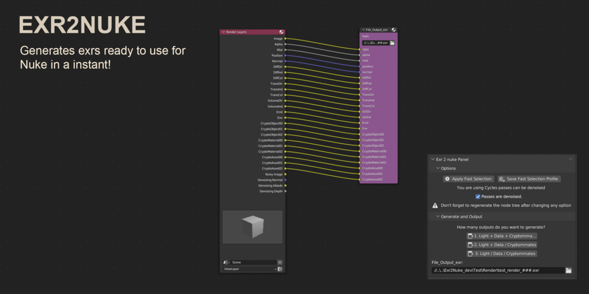

# Exr2Nuke

Generate Blender compositor outputs for multilayer EXRs, with clear pass names and optional Cycles denoising.

[Download the updated add-on](https://github.com/adrien-blanchard/exr2nuke/releases/latest) · [Original Gumroad download](https://lucasrouge.gumroad.com/l/exr2nuke)



Created in 2023 by **Lucas Rouge and Adrien Blanchard**, and originally distributed on Gumroad. This repository maintains the original tool; the image above is its original product artwork.

## What it does

- Group enabled passes into **one**, **two** or **three** multilayer EXR outputs.
- Separate light, data and Cryptomatte when needed.
- Denoise supported light passes in Cycles.
- Save and reuse a pass-selection profile for each render engine.
- Regenerate only the nodes managed by Exr2Nuke, keeping your other compositor nodes.

## Install and use

1. Download `Exr2Nuke-1.1.1.zip` from **Releases**. Do not extract it.
2. In Blender, open **Edit > Preferences > Add-ons > Install from Disk**, select the ZIP and enable **Exr2Nuke**.
3. Choose Cycles or Eevee, then open **View Layer Properties > Exr2Nuke**.
4. Enable your passes, choose an output grouping and set the output paths.
5. Render, then read the resulting EXRs in Nuke.

Regenerate after changing passes or denoising. Empty output groups are omitted. Profiles are stored in Blender's user configuration, not inside the installed add-on.

Tested in Blender **5.0.1 and 5.2.0 LTS** on Windows, including real Cycles EXR renders and Cryptomatte metadata checks. A licensed Nuke round-trip is not part of the automated tests. The original Gumroad ZIP targets Blender 3.x; use the updated release for current Blender.

## Development

```text
blender --background --factory-startup --python-exit-code 1 --python tests/blender_smoke.py
blender --background --factory-startup --python-exit-code 1 --python tests/render_smoke.py
python scripts/build_addon.py
```

[Maintenance notes](docs/maintenance.md) · [GPL-2.0-or-later](LICENSE)
